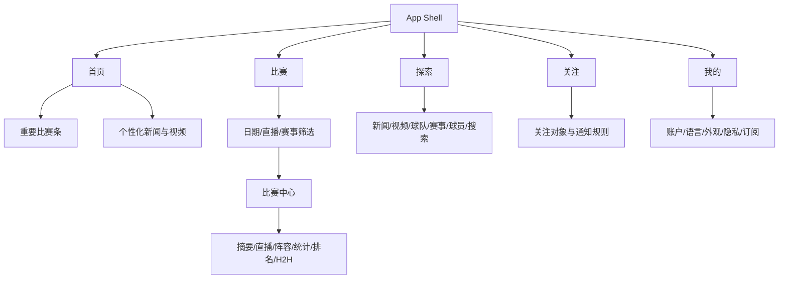

# PRD：阿拉伯语优先的体育超级 App

> 项目代号：SportsHub（非最终品牌）  
> 状态：研究后初稿，等待产品方向确认  
> 目标平台：iPhone；阿拉伯语 RTL 优先，英语完整支持

## 1. Summary

SportsHub 是面向沙特与 MENA 体育用户的原生 iPhone 应用。它把个性化体育新闻、实时比分、深度比赛中心、球队/球员/赛事关注、视频内容和 iOS 实时系统体验整合在一个清晰的五栏结构中。

它吸收 GOAT、Koora Break、SEC Sports 和 Jdwal 的公开功能优点，但使用自有品牌、视觉和信息架构，不复制任何受保护内容或私有接口。

## 2. Contacts

| 角色 | 负责人 | 职责/备注 |
|---|---|---|
| 产品负责人 | 用户 | 决定目标市场、品牌、内容范围和预算 |
| 产品与工程协作 | Codex | 调研、规格、代码实现、自动化测试与技术文档 |
| iOS 发布负责人 | 待定 | 需要 macOS、Xcode、证书和 App Store Connect 权限 |
| 体育数据/内容负责人 | 待定 | 供应商合同、赛事覆盖、内容版权与纠错流程 |
| 编辑/运营 | 待定 | 新闻、专题、推送、视频和内容审核 |
| 法务/隐私 | 待定 | 数据保护、儿童/UGC、版权、地区与直播权利 |

## 3. Background

现有产品通常偏向某一侧：GOAT 的阿拉伯语个性化新闻，Koora 的新闻互动，SEC 的直播/点播，Jdwal 的深度足球数据。用户需要在多个 App 之间切换，才能同时获得“今天看什么、比赛发生了什么、赛后读什么、视频在哪里”。

综合产品的机会是把这些任务放进一套稳定的信息架构，并利用 iOS 的通知、Widget、Live Activities、离线缓存和无障碍能力降低回访成本。

项目当前没有现成工程。开发环境是 Windows；可以在此完成规格、后端、接口契约和大部分源代码，但真正的 iOS 编译、模拟器、签名、推送、Live Activities 和 App Store 验证必须在 macOS + Xcode 上进行。

## 4. Objective

### 产品目标

让阿拉伯语体育用户在 30 秒内完成三件事：知道关注球队的最新动态、看到今天的比赛状态、进入一场比赛的可信详情。

### 业务价值

- 以每日赛程、实时事件和个性化提醒形成高频回访。
- 以独家新闻、视频和球队频道形成区别于通用比分工具的内容价值。
- 在核心留存成立后，再通过广告、去广告订阅、赞助频道或高级数据建立商业化。

### 首次公开测试的 SMART 结果

1. 至少 90% 的测试用户能在 60 秒内完成语言选择并关注一支球队。
2. 首页、比赛列表、比赛中心三个核心路径的任务成功率达到 95%。
3. 沙盒比赛事件从供应商到客户端展示的 P95 延迟小于 10 秒；最终阈值以供应商 SLA 调整。
4. 无网络重启后，用户仍能查看最近成功加载的首页、赛程和收藏对象。
5. Arabic/English 两种布局均通过动态字体、VoiceOver、RTL/LTR 和深色模式的自动/人工检查。
6. TestFlight 阶段崩溃自由会话达到 99.5% 以上。

## 5. Market Segments

### 核心用户：关注沙特联赛的阿拉伯语足球迷

任务：快速知道关注球队今天是否比赛、比分变化、阵容、赛后新闻和视频。

约束：比赛时对延迟和准确度极敏感；错误推送会迅速破坏信任。

### 第二用户：同时关注欧洲主流联赛的 MENA 足球迷

任务：在一个界面跟踪多个联赛、球队和球员，并过滤噪音。

约束：不同赛事数据深度、Logo 和视频权利并不相同。

### 第三用户：偏好体育视频和原创节目的观众

任务：发现、收藏、续播直播/点播内容。

约束：视频供应、CDN、DRM、地区限制和观看成本决定体验可行性。

### 无障碍用户

任务：通过 VoiceOver、动态字体、清晰焦点顺序和非颜色提示完成相同核心流程。

## 6. Value Propositions

| 用户任务 | 现有痛点 | SportsHub 的方案 |
|---|---|---|
| 查看今天最重要的比赛 | 比分和新闻分散 | 首页首屏显示关注对象与重要比赛，再进入新闻流 |
| 跟进一场比赛 | 多页面切换、事件缺上下文 | 一个比赛中心容纳摘要、直播事件、阵容、统计、排名和 H2H |
| 获得相关而非泛化新闻 | 新闻流噪音大 | 以球队/赛事/球员关注关系生成“为你推荐”，并允许解释推荐原因 |
| 不打开 App 也能看状态 | 需要反复刷新 | 通知 + Live Activity + Widget，且通知规则可细分 |
| 网络不稳定时查看数据 | 空白页或重复加载 | 最近成功数据、本地收藏和阅读进度可离线 |
| 看直播/集锦/原创节目 | 内容入口分散 | 独立视频域、分类探索、收藏、观看历史和续播 |

差异化原则：不是功能最多，而是“同一关注关系贯穿新闻、比赛、提醒和视频”，并明确显示数据更新时间与来源，建立可信度。

## 7. Solution

### 7.1 UX 与信息架构

主导航固定为五栏；在 RTL 模式中顺序与方向自然镜像：

#### 启动与引导

- 首次启动：语言 → 兴趣运动 → 关注球队/赛事/球员 → 通知说明 → 进入首页。
- 允许跳过登录；收藏先保存在本地，登录后再合并。
- 不在第一屏索要所有系统权限。通知只在用户关注对象后解释价值并申请。

#### 首页

- 顶部：品牌、搜索/通知状态、头像。
- “为你关注”：球队/赛事/球员圆形快捷栏，可编辑。
- “今日重要比赛”：横向小卡，显示状态、比分、开赛时间和 Live 标记。
- 混合信息流：新闻、赛前预告、比分摘要、视频；每张卡显示类型、来源和更新时间。
- 下拉刷新、分页、骨架屏、离线/过期数据提示。

#### 比赛

- 日期滑条、日历、直播/关注/重要过滤器。
- 按赛事分组；分组头可进入赛事详情。
- 单场卡：主客队、队徽（有授权时）、比分/时间、比赛状态、关注和提醒入口。
- 不用颜色单独表达胜负或直播状态。

#### 比赛中心

- 可折叠固定比分头；显示数据来源与最后更新时间。
- 页面：摘要、直播、阵容、统计、排名、H2H。
- 直播事件按时间线；纠错事件必须能覆盖先前错误，不允许只追加。
- 支持分享通用链接；无 App 时落到 Web 预览或商店页。

#### 探索

- 全局搜索；分类为新闻、视频、球队、赛事、球员。
- 视频支持直播、回放、集锦、原创、采访；展示地区/登录/授权限制。
- 新闻列表与详情、分享、收藏；评论/反应在社区阶段开启。

#### 实体详情

- 球队、球员和赛事都提供服务端明确关联的近期新闻与视频，不用名称或标题在客户端猜关系。
- 赛事“最新”不依赖赛季；积分榜、榜单和赛程仍要求有效赛季。球员近期内容位于统计与转会之间，加载失败互不遮挡。
- 新闻与视频采用带文字和图标的双轨版式、独立空态和权利提示；内容出现不代表获得视频播放权。

#### 关注

- 管理球队、球员、赛事和视频收藏。
- 每个对象单独配置：开赛、阵容、进球、红黄牌、半场、全场、突发新闻。
- 展示上一场、下一场、近期新闻和相关视频。

#### 我的

- 登录/账户合并、语言、深浅色、动态字体预览、通知总控。
- 下载/缓存占用、清除历史、隐私权、导出与删除账号。
- 观看历史、继续观看、订阅/去广告（启用时）。

### 7.2 Key Features

#### A. 基础与账户

- Arabic/English 完整本地化与 RTL/LTR。
- 游客模式、Sign in with Apple；按需要增加邮箱/手机号，不默认多收集数据。
- 关注关系、设备令牌、通知偏好和账号删除。

#### B. 新闻与内容

- 编辑新闻流、突发标记、文章详情、来源、作者、发布时间、分享和收藏。
- 文章卡与详情可展示经上游确认发布权利的双语主图；必须携带显式替代文本和署名，并以精确 CDN 主机、尺寸、MIME、字节上限及安全占位契约失败关闭。公开网页图片不得直接抓取商用。
- 结构化 Visual Brief 支持双语指标、两项对比、序列和始终可见的数据说明；不接受任意 HTML/SVG 或未经授权的远程素材。
- 新闻卡可显示服务端权威的公开总反应数与已发布评论数快照；缺失时隐藏，不混入个人状态、不据此排序，也不伪造分享次数。
- 个性化 feed 先使用透明规则：关注匹配 + 新鲜度 + 运营优先级；积累足够行为数据后再评估机器学习。
- CMS 支持草稿、审核、定时发布、更正、撤回和推送预览。

#### C. 比赛数据

- 赛程、实时比分、状态、事件、阵容/阵型、统计、积分榜、射手榜、红黄牌榜、H2H、历史赛季。
- 球队、球员、赛事、赛季实体页；转会中心和重要赛历。
- 球员与赛事实体页包含最多 10 篇新闻和 10 条视频的 Provider 权威近期频道；空数组只表示当前有界窗口没有已确认项目。
- 电视台/解说信息只在提供商允许且地区准确时展示；当前客户端已实现只读、无播放链接的地区化元数据契约，真实排期与商标仍待授权供应商。

#### D. 实时系统体验

- APNs 通知；服务器按用户规则去重、限流和撤销错误事件。
- ActivityKit Live Activity 显示比分、比赛时钟和最新事件。
- WidgetKit 提供下一场、关注球队和今日比赛组件。

官方平台参考：[ActivityKit](https://developer.apple.com/documentation/activitykit)、[WidgetKit](https://developer.apple.com/documentation/widgetkit)、[UserNotifications](https://developer.apple.com/documentation/usernotifications)。

#### E. 视频

- AVKit/HLS 播放器、字幕/多音轨、清晰度适配、画中画（权利允许时）。
- 直播、回放、集锦、原创节目；收藏、历史、续播。
- 服务端下发区域、登录、年龄和授权窗口；客户端不能靠隐藏按钮代替权利控制。

官方平台参考：[AVKit](https://developer.apple.com/documentation/avkit)。

#### F. 离线、搜索与无障碍

- 缓存最近首页、未来/近期赛程、收藏对象和文章阅读进度；所有缓存有版本和过期策略。
- 搜索支持阿拉伯文正规化、英文别名和实体类型过滤。
- VoiceOver、动态字体、减少动态效果、足够对比度、44pt 触控目标、完整键盘/焦点语义。

#### G. 社区、预测与商业化（后期）

- 新闻反应、评论、举报、屏蔽、审核和风控必须成套上线。
- 世界杯/联赛预测先做无现金奖励版本；地区博彩法律审查通过前不提供押注或可兑换奖品。
- 订阅与去广告使用 StoreKit 2；首个客户端切片只接受本机验证的当前权益并提供显式恢复，规模化生产发布前再加入 App Store Server API/Notifications V2 对账、退款和跨设备审计。

官方平台参考：[StoreKit](https://developer.apple.com/documentation/storekit)。

### 7.3 Technology

#### iOS 客户端

- SwiftUI + Swift Concurrency；最低 iOS 17.0（待用户确认设备覆盖）。
- `NavigationStack`、按 Feature 拆分、依赖注入、可测试 ViewModel/Use Case。
- `URLSession` + Codable；REST 获取快照，WebSocket/SSE 接收比赛事件。
- 本地数据库保存实体与缓存；App Group 共享 Widget/Live Activity 所需的小型状态。
- 支持 Universal Links、APNs、ActivityKit、WidgetKit、AVKit、StoreKit 2。
- 第三方 SDK 保持最少，分析、崩溃和视频 DRM 均需要隐私审查。

#### 后端与运营

- 模块化 BFF/API：账户、内容、体育数据、Feed、搜索、视频、通知、互动、权益。
- PostgreSQL 保存规范化业务数据；Redis 用于热点比分、限流和事件 fan-out；对象存储 + CDN 保存已授权媒体。
- 供应商适配器把外部 ID 映射为内部稳定 ID，避免供应商锁定。
- CMS/运营台管理文章、专题、视频元数据、推送、数据更正和内容下架。
- OpenAPI 作为客户端/服务端契约；所有接口支持版本、幂等、游标分页和可观察性 ID。

#### 核心数据实体

`User`、`Device`、`Follow`、`NotificationRule`、`Sport`、`Competition`、`Season`、`Team`、`Player`、`Fixture`、`FixtureEvent`、`Lineup`、`Statistic`、`Standing`、`Article`、`VideoAsset`、`WatchProgress`、`Reaction`、`Comment`、`Prediction`。

#### 安全与隐私

- 只收集交付功能所需的数据；位置不是核心需求，默认不申请。
- 传输加密、Keychain 凭证、服务端短期访问令牌、刷新令牌轮换、删除/导出流程。
- 编辑、推送、视频和数据纠错动作进入审计日志。
- 社区上线前必须满足 Apple 对 UGC 的过滤、举报、屏蔽和联系方式要求。

### 7.4 Assumptions

以下都没有被当前资料证明，必须在开发闸门中验证：

1. 产品目标是沙特/MENA，默认 Arabic-first + English；不包含中文界面。
2. 用户愿意把“新闻 + 比分 + 视频”集中在一个产品，而不是继续使用多个专门 App。
3. 能获得沙特联赛及目标欧洲赛事的商业数据再分发权。
4. 能获得合法新闻、图片、队徽、视频和直播内容；公开网页不能被直接抓取后商用。
5. 有 macOS/Xcode、Apple Developer 与 App Store Connect 环境完成真机和发布验证。
6. 直播、社区、预测与广告的法务和运营成本可被接受。

## 8. Release

### Release 0：可点击产品骨架

相对周期：1 个短迭代。

- 自有设计系统、Arabic/English、RTL/LTR、五栏导航。
- 本地样例数据覆盖引导、首页、比赛列表、比赛中心、文章详情和关注。
- 无真实登录、推送、视频流或付费。

### Release 1：核心可用 Beta

相对周期：2–4 个迭代，取决于数据供应商。

- 真实赛程/比分/事件/阵容/统计/积分榜适配。
- 新闻 CMS、收藏、本地缓存、搜索、游客模式与账号。
- 通知和一场比赛 Live Activity。
- TestFlight、错误监控、隐私清单和基础运营台。

### Release 2：内容与系统能力

相对周期：2–3 个迭代。

- 视频点播、集锦、原创节目、观看历史与续播。
- Widget、历史赛季、H2H、转会中心、播出信息。
- 完整 VoiceOver 与弱网/离线优化。

### Release 3：高级增长能力

相对周期：按权利与留存证据决定。

- 获得授权的体育直播和回放。
- 社区反应/评论及审核后台。
- 无现金预测、专题玩法。
- 广告、订阅去广告或高级权益。

### 当前明确不进入首版

- 未授权的直播流、新闻抓取、摄影图片或队徽。
- 没有审核体系的评论区。
- 现金、可兑换奖品或博彩性质预测。
- 在没有真实使用数据前构建复杂 AI 推荐。
